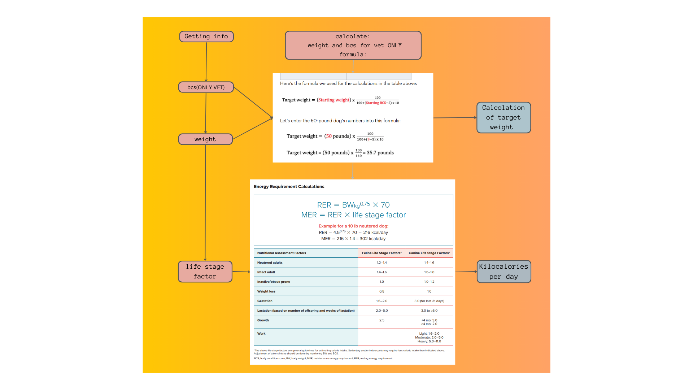
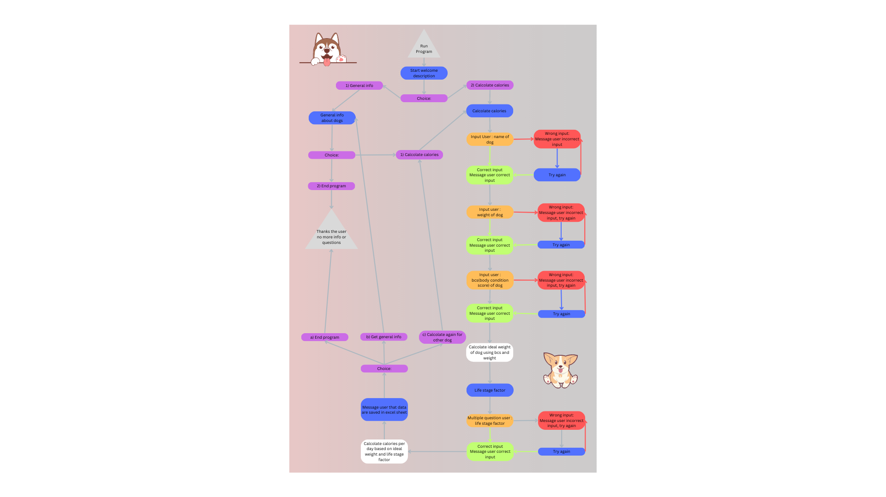
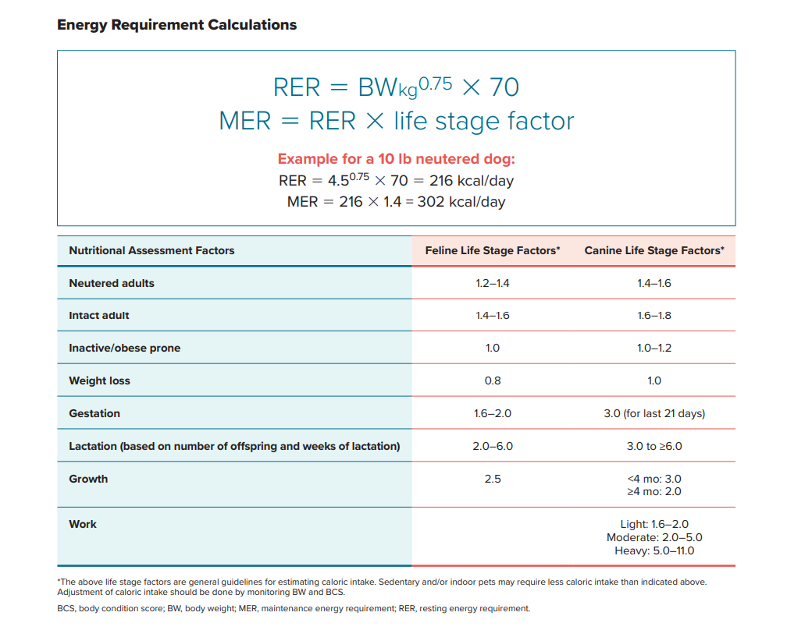
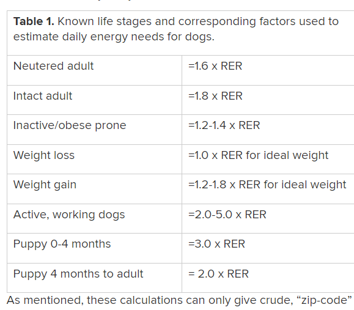
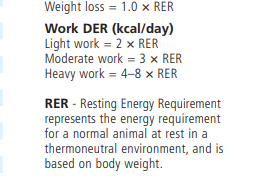

# **Vet Seed**

[View the live project here](https://vet-seed.herokuapp.com/)
     

## **Table of contents**
***
1. [Introduction](#introduction)
2. [UX](#ux)
    1. [Ideal User Demographic](#ideal-user-demographic)
    2. [User Goals](#user-goals) 
3. [Development Planes](#development-planes)
4. [Features](#features)  
    1. [General Features](#general-features)
    2. [Future features](#future-features)
5. [Design](#design)
6. [Issues and Bugs](#issues-and-bugs)
7. [Technology Used](#technology-used)
    1. [Languages Used](#languages-used)
    2. [External Programs-Website Used](#external-programs-website-used)
8. [Testing](#testing)
9. [Deployment](#deployment)
10. [Credits](#credits)
    1. [Content](#content)
    2. [Code](#code)
11. [Acknowledgements](#acknowledgements)

## **Introduction**
This is a back-end program for veterinarians to do the following:

- Calcolate and save data of subjects (in this case dogs).
- Calcolate if the dog is underweight, overweight or in ideal weight.
- Calcolate as well calories per day that dog should take based on weight and life stage.
- Get general information about dogs.
- Be able to save and have summary of all dogs inserted.
- Be able to save more dogs and have them display all together.

The developer wanted to address a real-every-day problem such as calculate how many calories per day a dog should get based on different factors.

This is a program created for the third of five Milestone projects required to complete the Diploma in Software development (eCommerce Applications) program at **Code Institute**.
The main requirement of this project is to use  **PYTHON** as the main technology. 

## **UX**

### Ideal User demographic

The ideal user demographic for this program are:
- Veterinarians
- People with basic information on BCS to calculate how many calories per day to give dog

### User goals

The developer divided user goals into the following categories:
1. New user
2. Old user

**New user** 

The main goals are the following:

- Understand straight away what this program can offer
- Be able to create an account
- Get general information on dogs
- Be able to calculate if dog is overweight, underweight, or ideal weight
- Calculate which one should be the ideal weight for the dog
- Calculate how many calories per day I should give the dog
- See the summary of the calculation in a table or a file

**Old user** 

The main goals are the following:

- Be able to log in without creating another account
- Calculate another dog's calories and ideal weight
- Be able to have a summary of all dogs already inserted
- Read general information as many times as needed

[Back to top ⇧](#Vet-Seed)

## Development Planes

Project purpose:

To build a command-line application that allows users to manage a common dataset about a particular domain.

The vet application was chosen by the developer for the personal interest of the developer in dogs, and to try and create something useful for an everyday task to address a specific target audience. 

Development planes were made in the following order:
- Strategy
- Scope
- Structure
- Skeleton

### Strategy

Used to determine developer goals and user needs.

Chosen target audience: 

1. Veterinarian 
2. People with basic vet information

#### Developer Goals

The developer goals were the following:
- Create an application that could pass through validators without error
- Address an everyday need and try to simplify human tasks using language learned
- Present the application in a clean and easy-to-understand manner
- Try to give even if simple good UX experience

#### User needs

User needs were the following:
- Calculate if a dog is under, over, or ideal weight
- Calculate how many calories to give to the dog based on the weight
- Have visual effect if wrong or right input inserted
- Summary at the end of the program with all information displayed
- Few questions to simplify the process
- After each section choose to end the program

The developer has to get the following information about the user:
- Username
- Password
- Unicode ( just for login )

When a username and password are created and validated, a random number called *Unicode* will be assigned to a user.

The user will have to save this number to login.

The developer has to get the following information about the dog:
- Name
- Weight
- BCS (Body Score condition)
- Life Stage

### Scope

Now that we have established the goals of the program we can deduce the necessary features:

1. Multiple choice for the user to let him decide what he would like to do
2. Inputs to insert required data
3. Color effect on right and wrong values inserted
4. Message user frequently based on the process and the values given
5. Calculate the final calories per day to give the dog
6. Calculate difference between weight an ideal weight
7. Table to insert at the end of the program for a summary of values provided and calculated
8. Saved user data in an external sheet
9. Save dog's data to be able to access it when the user login

### Structure

Structure for the application was made using [Canva](https://www.canva.com/ "Link to Canva").

Firstly the developer searched all information online to see how to calculate everything and create a basic structure.

With the information found then she created a formulas chart.

Formulas for flowchart

    

 

Then the developer creates a structural map based on importance and on how to calculate everything.

The structure was then divided in two main sections:
1. General info = Where the user will just get information
2. Main section = Where the user will insert data and get back the result

Map structure

    

 

The map structure was changed slightly, adding the multiple-choice possibility for the user to show saved dogs in final table.

[Back to top ⇧](#Vet-Seed)

## Features

### General Features

- **General section** = User will get general information and advice on dogs based on weight, BCS, and life stage.
- **Input**:
    1. **Name** = Name of dog ( max 10 letters )
    2. **Weight** = Weight of the dog measured at the moment ( from 0 to 100 kg)
    3. **BCS** = 0 to 9 ( 9 scale BCS )
    4. **Life Stage** = Depending on the following criteria:
        - Working dog = Exercise( Light: 2 - Moderate: 4 - Heavy: 6)
        - No working dog = If the dog ( Intact: 1.8 - Neutered: 1.6)
        - Ideal, over or underweight = If a dog ( Ideal weight: life-stage * weight - Over/Underweight: life-stage * ideal weight)
- **Calculation**:
    1. **Ideal weight** = Based on BCS and weight
    2. **Calories** = How many calories per day should the dog get based on ideal weight and life stage.
- **Table** = Summary table at the end of the application with all data inserted from the user and conclusion.
- **Multiple choice** = Used mainly to change section from main to general and vice versa. Or to restart and end the program.
- **Visual effect** = To give users a better UX experience.
- **Google sheet** = To get the data, and saved it the developer used gspread This [Google worksheet](https://docs.google.com/spreadsheets/d/1EuL6-9dUeOpWHPw4PDz_4Va0h-h8RzdyvA5FndIxqZE/edit#gid=174924801 "Link to Google sheets page") can be used to visualize how the data are saved and stored. 

### Future features

Due to limited resources (time constraints, skills of the developer at the moment, and other reasons), some features were not implemented.

1. Be able to access old dog's data with login and be able to update already saved data with new values. Having updated data showed as well in the final summary.
2. Be able to access in get general information automatically the correct options, without printig all the list manually. Developer in authomatic was checking if the input inserted from user was in the list until *N 5 error (explained in issues and bugs)* was found.
3. Be able to find a solution for the unfixed bug, disabling and unabling keyboard pres during slow_type text.

## Design

The design of a command line application is usually very simple. The developer though decided that for a better UX experience would be implemented:

- **Colors**:
    1. **Red** = Would be assigned to a wrong value inserted by the user to help him visualize the error.
    2. **Green** = Would be assigned to the correct value inserted by the user to help him visualize that no error was given when data are saved correctly and intro and ASCII art.
    3. **Blue** = Would be assigned to general information and return calculation to highlight it from other text.
    4. **Yellow** = Would be assigned to important data, such as if the dog is underweight or overweight.
- **Space** = More space between sections and important sentences to highlight the right information.
- **Time** = Between different functions and calculations for better UX.
- **Clear** = Functionality to eliminate section by section to not overwhelm the user with information.
- **Intro design** = Intro design using ASCII art, to give a better user experience.
- **Tabulate** = Fancy tabulate in blue, to give a better user experience when showing saved information to the user.

[Back to top ⇧](#Veet-Seed)

***

## Issues and bugs

The developer found different issues and bugs during the creation of the application, the main issues and bugs are listed below.

1.  -  *Issue*: If a user created the account and would just get general information, credentials would have not been saved in the external sheet.
    - *Solution*: Instead of saving all data directly in update_worksheet at the end of calculate dog, the developer adds update_worksheet when selecting end program so that also if the user created the account and ends the program, the user information will be saved.
2.  -  *Issue*: When saving and calculating two dogs, instead of showing in the table in different lines, all info was appended to the same line,     
    modifying all data and final tabulate.
    -  *Solution*: Developer searched for a way of clearing the global variables where saving the list of information, each time the user wanted to calculate a new dog.
    Used [StackOverflow](https://stackoverflow.com/questions/850795/different-ways-of-clearing-lists "Link for stackoverflow specific article") : del INFO[:] 
    Empty the list before starting to calculate a new dog.
3.  -  *Issue*: When calculating mer the calculation would have always returned that the dog was underweight also if it shouldn't.
    -  *Solution*: Typing mistakes of the developer was using the wrong index from saved data that return wrong calculations. Change for the right index to fix minor issues.
4.  -  *Issue* : Big issue found when printing the tabulate in show_dogs function. When the user login it would have worked perfectly, while when creating the 
    account, it was displaying an empty tabulate.
    -  *Solution*: To find the solution the developer first prints out all the data to see if not correct data were arriving in the final function. When checked that all data were correct, the developer try to understand the difference in the path between login and creating an account. The only difference was the Unicode. But the Unicode was arriving in the final function perfectly when printed out in the final function Unicode was correct. At that point, the developer thought that the path for the Unicode to arrive was different. From login, it would have arrived from the external sheet, while creating the account from another function. So that is how the developer arrive at to understand that the *Type* of Unicode was different. Printing out the Unicode developer saw that one was an INT and the other a STR. To fix the error finally developer just implemented in last function str(Unicode).
5.  - *Issue* : When testing the application , developer found an error that would stop all application, when user select 0 in get general information. It      
    would have given the 
    following error: gspreaad.xxceptions.IncorrectCellLabel : (1, 0).
    The developer tried to check if the value inserted was equal to 0 or minor than the printed options, but it would have still give the error.
    - *Solution* : To solve the issue, developer add a new if statement to check if the number was in the possible option list, and it fixed the issue.

[Back to top ⇧](#Veet-Seed)

***

## Technology Used

### Languages Used

The main language used was **Python**.
All other languages used were provided by **Code institute** to use as a base to show the deployed project.

### External Programs-Website Used

The developer used different external programs throughout the development of this project.

Below are all the external programs used :
- [Heroku](https://heroku.com  "Link to Heroku homepage")
     - Heroku was used to deploy a final project.
- [GitPod](https://gitpod.io/ "Link to GitPod homepage")
     - GitPod was used for writing code, committing, and then pushing to GitHub.
- [GitHub](https://github.com/ "Link to GitHub")
     - GitHub was used to store the project after pushing.
- [Canva](https://www.canva.com/ "Link to Canva homepage")
     - Canva was used to create structural and formulas maps.
- [Am I Responsive?](http://ami.responsivedesign.is/# "Link to Am I Responsive Homepage")
     - Am I Responsive was used to see responsive design throughout the process and to generate mockup imagery to be used.
- [Ezgif](https://ezgif.com/video-to-gif "Link to go to ezgif homepage")
    - Ezgif was used to convert all videos to gifs for the testing file.
- [Free screen recorder](https://screencast-o-matic.com/screen-recorder?from=app&installed=true "Link to go to Free screen recorder homepage")
    - Free screen recorder was used to screen record all videos for the testing files.

[Back to top ⇧](#Veet-Seed)

***

## Testing

Testing information can be found in a different Testing [file](TESTING.md "Link to testing file")

## Deployment

The project was written with GitPod, and pushed to [GitHub](https://github.com/ "Link for github homapage"). It was then deployed on [Heroku](https://heroku.com "Link for Heroku homapage").

To deploy everything to Heroku the following steps were taken:

1. Add dependencies in GitPod to requirements.txt file with command "pip3 freeze > requirements.txt"
2. Commit and push to GitHub
3. Go to the Heroku Dashboard
4. Click "Create new app"
5. Name app and select location
6. Add Config Vars for Creds and Port in Settings tab
7. Add the buildbacks to Python and NodeJS in that order
8. Select appropriate deployment method, GitHub
9. Connect to Github and link to repository
10. Enable automatic deployment
11. Click on Deploy

[Back to top ⇧](#Veet-Seed)

***

## Credits

### Content

All knowledge on which formulas to use for all calculation in the project, and all general information were token by the developer from the following:

#### General information

General information is displayed in getting general information and was summarized from the following articles:

- *Dangerous food for dogs* : [Pets](https://pets.webmd.com/dogs/ss/slideshow-foods-your-dog-should-never-eat "Link to pets specific article")
- *Human food good for dogs* : [Cosmicpet](https://www.cosmicpet.com/blogs/news/12-healthiest-human-foods-for-dogs "Link to Cosmicpet specific article") and [MarieClaire blog](https://www.marieclaire.it/lifestyle/coolmix/a19428033/cosa-dare-da-mangiare-al-cane/ "link to Marieclaire specific article")
- *Four healthy habits for dogs* : [Daisybeet](https://www.daisybeet.com/4-healthy-habits-to-establish-for-your-dog/#:~:text=Dogs%20thrive%20with%20a%20daily,expected%20of%20them%20and%20when "Link to Daisybeet specific article")
- *BCS = Body condition score* : [Petmd](https://www.petmd.com/dog/nutrition/how-find-your-dogs-body-condition-score "Link to Petmd specific article")
- *When a dog become a senior* : [Thehealthypets](https://www.thehealthypetclub.co.uk/when-will-my-dog-become-a-senior/ "Link to Thehealthypets specific article")
- *6 signs your dog is healthy* : [Petinsurance](https://www.petinsurance.com/healthzone/pet-health/health-conditions/6-signs-your-dog-is-healthy/ "Link to petinsurance specific article")
- *Why and when contact the vet* : [Vetmd](https://vetmed.tamu.edu/news/pet-talk/when-to-call-a-veterinarian/ "Link to Vetmd specific article")

#### Formulas

The following formulas were find by the developer in order to calcolate ideal weight, and which value to use based on life stage of the dog:

- *Energy requirements calculation* : [Aaha](https://www.aaha.org/globalassets/02-guidelines/2021-nutrition-and-weight-management/resourcepdfs/nutritiongl_box1.pdf "Link for aaha.org pdf")
- *Calculate dog healthy weight* : [Petmd](https://www.petmd.com/dog/care/how-calculate-your-dogs-healthy-weight "Link for petmd specific article")
- *Life stage factors* : [Vet osu](https://vet.osu.edu/vmc/companion/our-services/nutrition-support-service/basic-calorie-calculator "Link for vet specific article") 
- *Working dogs factor* : [Wilmotveterinaryclinic](https://wilmotveterinaryclinic.com/wp-content/uploads/2016/10/Resting-Energy-Requirements.pdf "Link for wilmotveterinaryclinic specific article")

Energy requirements and healthy weight

        

Life stage factors

        

Working dog factor

        

### Code

Different website were checked during the duration of the project. Mostly the developer checked [Stackoverflow](https://stackoverflow.com/ "Link to stackoverflow homepage") to resolve issues and for general knowledge.

Many times the developer checked online to resolve and check for information , below are a few links where developer found the answers:

- The developer checked this [Link](https://stackoverflow.com/questions/59036109/python-how-to-check-if-input-is-a-letter-or-character "Link to stackoverflow specific article") to check for if input inserted was a letter or int .
- The developer checked this [Link](https://www.freecodecamp.org/news/python-sleep-time-sleep-in-python/ "Link to freecodecamp specific article") to check how to stop and wait for a specific time before running next function.
- The developer checked this [Link](https://stackoverflow.com/questions/23623288/print-full-ascii-art "Link to stack overflow specific article") to check how to print ASCII art.
- The developer used his previous project, [Newline Alebrije](https://github.com/michmattera/newline-alebrije "Link to newline repository"), as a source for looking up the code for README purposes mainly.
- The developer used his previous project, [Star Wars Quiz](https://github.com/michmattera/star-wars-quiz "Link to star wars quiz repository"), as a source for looking up the code for TESTING purposes mainly.

[Back to top ⇧](#Veet-Seed)

***

### Acknowledgements

This whole project is dedicated to Carl Sagan, astronomer, planetary scientist, cosmologist, astrophysicist, astrobiologist, author, and science communicator.
His book 'Cosmos' inspired me as a child and geared me towards sciences and astronomy.

Without support I got from other people, this project would never be realized. I'll try and remember to thank everyone and everything I can!

- My family and my friends to help me find an interesting topic to build the project, and helped me testing it.
- To my girlfriend, thank you for always believeing in me and supporting me in everything that I do.
- Slack community, thank you for being a constant source of good information.
- For mu tutors, without them this application would have not been what it is, for their invaluable help and guidance throughout the process.
- Koko, my mentor, thank you for being an incredible source of solutions and good advice.
- Stack Overflow. Thank you for existing.

[Back to top ⇧](#Veet-Seed)

***

