# **VET-SEED - Testing** 

[Read Me file](/README.md)

[View Github repository](https://github.com/michmattera/vet-seed)

[View the live project here]()

## **Table of contents**
***
1. [Manual Testing](#manual-Testing)
    1. [User Inputs](#user-inputs)
        - [Incorrect Inputs](#incorrect-inputs)
        - [Correct Inputs](#correct-inputs)
    2. [General information](#general-information)
    3. [Getting datas](#getting-datas)
2. [Code validation](#code-validation)
3. [Bugs](#bugs)

## Manual testing

Manual testing was performed after deploying the project to heroku platform.

### User Inputs

#### Incorrect Inputs

Incorrect inputs were tested with the following criterias:

| Input | Empty | Lenght | Type | All |
| --- | --- | --- | --- | --- |
|  Login - Create | :heavy_check_mark: | :heavy_check_mark: | :heavy_check_mark: | :heavy_check_mark: |
| Login | - | - | - | :heavy_check_mark: |
| Create Username | :heavy_check_mark: | :heavy_check_mark: | - | :heavy_check_mark: |
| Create Password | :heavy_check_mark: | :heavy_check_mark: | :heavy_check_mark: | :heavy_check_mark: |
| Confirm Change | :heavy_check_mark: | :heavy_check_mark: | :heavy_check_mark: | :heavy_check_mark: |
| Ready | :heavy_check_mark: | :heavy_check_mark: | :heavy_check_mark: | :heavy_check_mark: |
| General info | :heavy_check_mark: | :heavy_check_mark: | :heavy_check_mark: | :heavy_check_mark: |
|  Calcolate Calories name | :heavy_check_mark: | :heavy_check_mark: | :heavy_check_mark: | :heavy_check_mark: |
|  Calcolate Calories weight | :heavy_check_mark: | :heavy_check_mark: | :heavy_check_mark: | :heavy_check_mark: |
|  Calcolate Calories bcs | :heavy_check_mark: | :heavy_check_mark: | :heavy_check_mark: | :heavy_check_mark: |
|  Is work dog | :heavy_check_mark: | :heavy_check_mark: | :heavy_check_mark: | :heavy_check_mark: |
|  Type exercise | :heavy_check_mark: | :heavy_check_mark: | :heavy_check_mark: | :heavy_check_mark: |
|  Neutered Intact | :heavy_check_mark: | :heavy_check_mark: | :heavy_check_mark: | :heavy_check_mark: |
| Multiple choice | :heavy_check_mark: | :heavy_check_mark: | :heavy_check_mark: | :heavy_check_mark: |

All incorrect error were checked after deployment , and all bugs or issue were then handled by the developer, making small chganges.

The following files shows all **incorrect input** of the user in the specific section:

 Login - Create

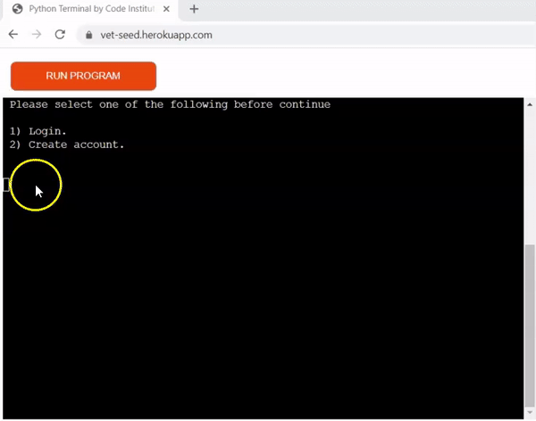

 Login

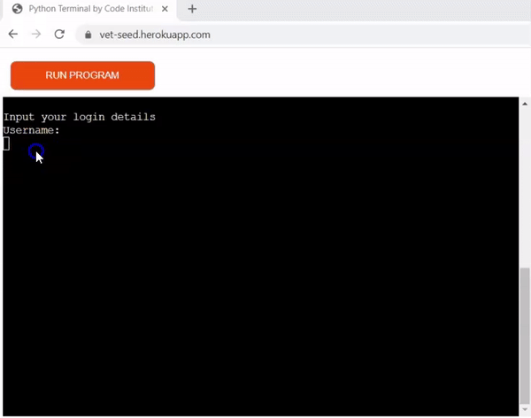

 Create username

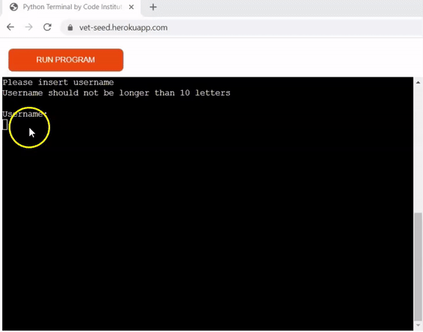

 Create password

 Confirm change

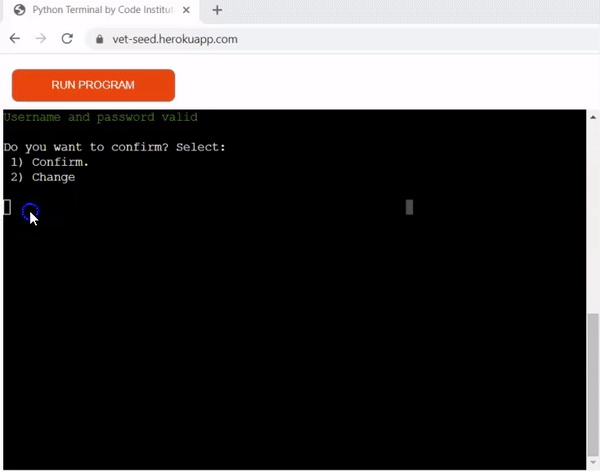

 Ready

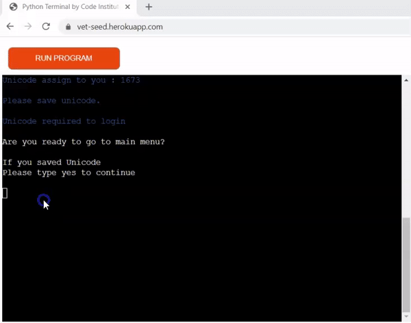

 General information

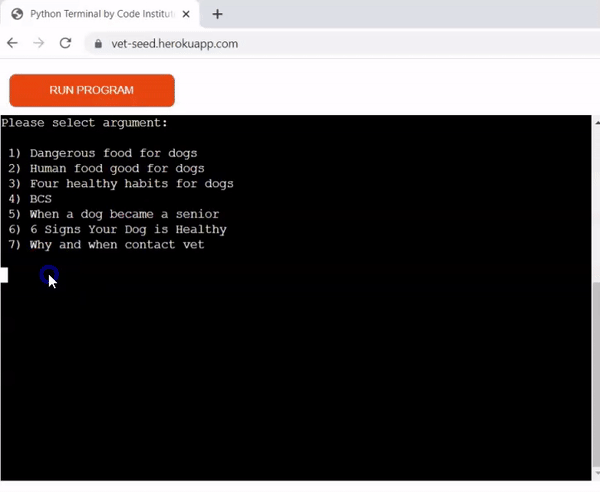

 Calcolate calories error name

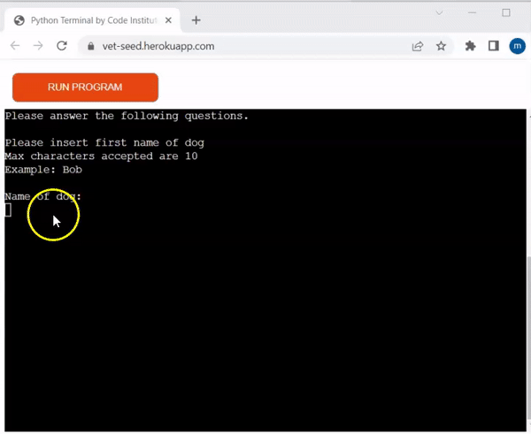

 Calcolate calories error weight

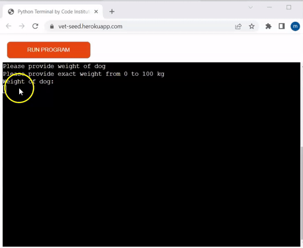

 Calcolate calories error bcs

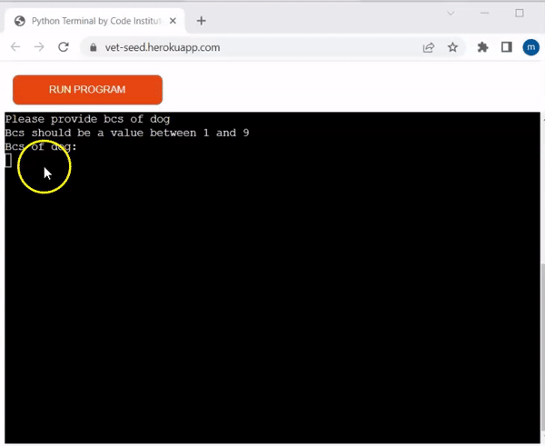

 Is work dog

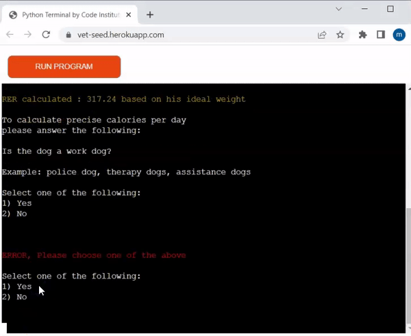

 Type of exercise

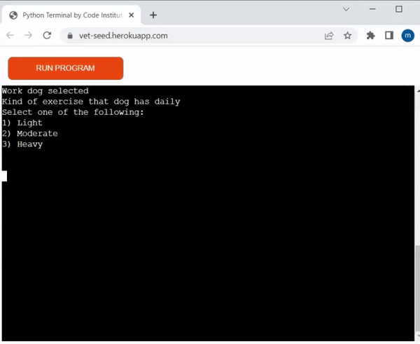

 Neutered intact

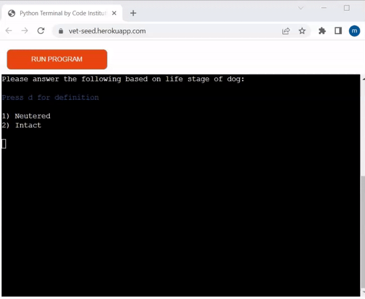

 Multiple choice

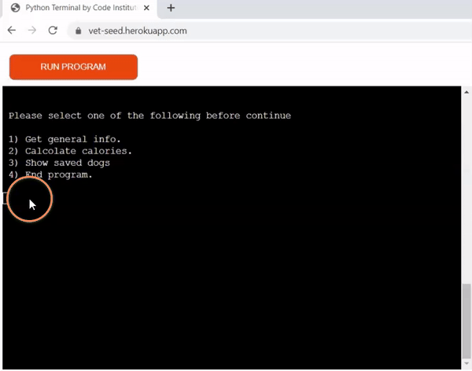

#### Correct Inputs

All correct inputs should display a message to user for better UX.
Correct inputs were all tested and checked.

| Input | Checked |
| --- | --- |
| Login - end program| :heavy_check_mark: |
| Create account | :heavy_check_mark: |
| Overweight|  :heavy_check_mark: |
| Ideal weight | :heavy_check_mark: |
| Underweight | :heavy_check_mark:|

 Login - End program

 Create account

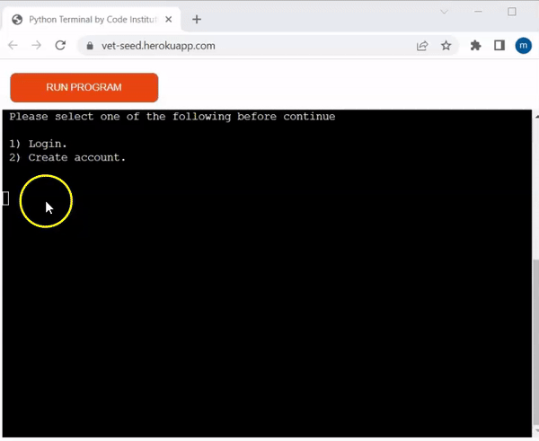

 Overweight

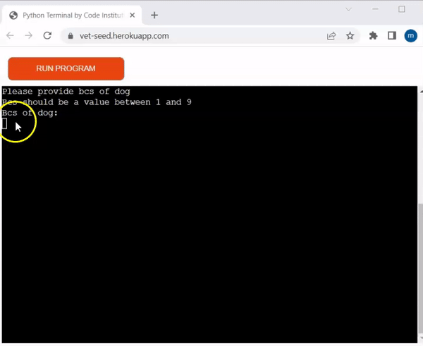

 Ideal weight

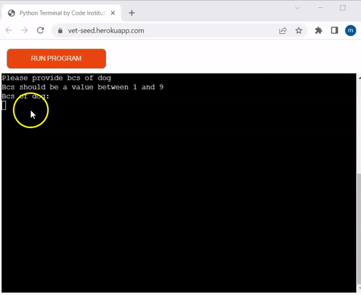

 Underweight

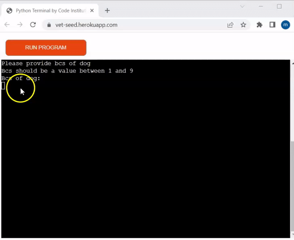

### General information

All general information are generated thanks to gspread, with an external sheet created by the developer.
All general information were tested to check they were displayed following the time , the space and to check that the right information were taken from the external sheet.

| General information | Checked |
| --- | --- |
| Login - end program| :heavy_check_mark: |
| Create account | :heavy_check_mark: |
| Overweight|  :heavy_check_mark: |
| Ideal weight | :heavy_check_mark: |
| Underweight | :heavy_check_mark:|

